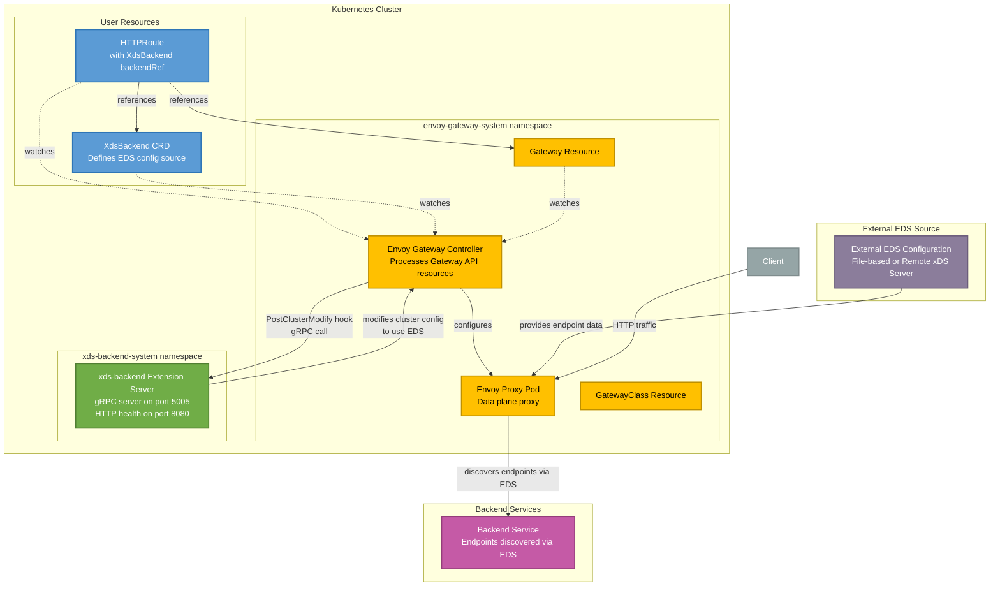

# xds-backend

> [!CAUTION]
> This is still WIP and has not been tested sufficiently in production yet!!!

## Overview

`xds-backend` is an Envoy Gateway extension that enables configuring backends to use external Endpoint Discovery Service (EDS) servers for dynamic endpoint discovery. This allows Envoy Gateway to route traffic to backends whose endpoints are managed outside of Kubernetes, such as through external xDS servers or file-based configurations.

## Architecture

The following diagram illustrates the architecture and data flow of the xds-backend extension:



### Component Details

1. **Envoy Gateway Controller**: Watches Gateway API resources (Gateway, HTTPRoute, XdsBackend) and generates Envoy configuration. When processing clusters, it calls the extension server's `PostClusterModify` hook.

2. **xds-backend Extension Server**: A gRPC server that implements the Envoy Gateway extension interface. It receives cluster modification requests and configures clusters to use EDS with the specified config source (file path or remote xDS server).

3. **XdsBackend CRD**: A custom Kubernetes resource that defines:
   - The EDS service name
   - The config source type (file path, remote xDS server, or ADS)
   - The API type (GRPC, DELTA_GRPC, or REST)

4. **Envoy Proxy**: The data plane proxy that:
   - Receives configuration from the Envoy Gateway controller
   - Discovers backend endpoints via external EDS configuration (file-based or remote xDS server)
   - Routes traffic to backend endpoints discovered through EDS

5. **External EDS Source**: The endpoint discovery configuration source, which can be:
   - A file-based source (e.g., ConfigMap mounted in the Envoy proxy pod)
   - A remote xDS server (configured as a static cluster in Envoy's bootstrap)

6. **Backend Service**: The target application service whose endpoints are dynamically discovered and managed through the external EDS configuration source.

## Quickstart Guide

This guide provides a high-level overview of the components needed to set up xds-backend with Envoy Gateway.

### Prerequisites

- Kubernetes cluster (1.24+)
- `kubectl` and `helm` installed
- `docker` and `go` (for building the extension server)

### Setup Overview

1. **Install Envoy Gateway**: Deploy Envoy Gateway with extension manager configured to connect to the xds-backend extension server. Configure the extension manager to:
   - Register the `XdsBackend` CRD as a backend resource
   - Enable the `PostClusterModify` hook
   - Point to the extension server's FQDN and port (default: `xds-backend.xds-backend-system.svc.cluster.local:5005`)

2. **Deploy Extension Server**: Build the extension server Docker image and deploy it using the provided Helm chart at `charts/xds-backend` in this repository. The chart automatically installs the XdsBackend CRD from the `crds/` directory. The extension server runs a gRPC service that Envoy Gateway calls to modify cluster configurations.

3. **Configure Gateway Resources**: Create a GatewayClass and Gateway resource following standard Gateway API patterns. The Gateway will be managed by Envoy Gateway.

4. **Set Up EDS Configuration**: Choose one of the following approaches:
   - **File-based EDS**: Create a ConfigMap containing endpoint discovery data in Envoy's EDS format and mount it in the Envoy proxy pods (see [Configuring File-based EDS](#configuring-file-based-eds))
   - **Remote xDS Server**: Configure a static cluster in the EnvoyProxy bootstrap configuration that points to your xDS server (see [Configuring Remote xDS Server](#configuring-remote-xds-server))

5. **Create XdsBackend Resource**: Define an XdsBackend resource that specifies:
   - The EDS service name
   - The config source (file path, remote xDS server, or ADS)
   - The API type (GRPC, DELTA_GRPC, or REST)
   - **Important**: If using a remote xDS server, the `server` name must match the static cluster name configured in the EnvoyProxy bootstrap

6. **Create HTTPRoute**: Create an HTTPRoute that references the XdsBackend resource in its `backendRefs`. If the HTTPRoute and XdsBackend are in different namespaces, create a ReferenceGrant to allow the cross-namespace reference.

### Verification

- Check extension server logs to confirm it's receiving requests from Envoy Gateway
- Verify Envoy cluster configuration via the Envoy admin API (port 19000) to ensure clusters are configured for EDS
- Test traffic routing through the Gateway to your backend endpoints

## Configuration Options

### XdsBackend Spec

The XdsBackend resource supports the following configuration:

- **`service`** (optional): The service name used when requesting endpoints from the xDS server
- **`apiType`** (required): The protocol to use (GRPC, DELTA_GRPC, or REST)
- **`server`** (optional): Configuration for a remote xDS server
- **`path`** (optional): Configuration for a file-based EDS source

### Extension Server Configuration

The extension server can be configured via Helm values:

- **`image.repository`**: Container image repository
- **`image.tag`**: Container image tag
- **`image.pullPolicy`**: Image pull policy
- **`service.grpcPort`**: gRPC server port (default: 5005)
- **`service.httpPort`**: HTTP health check port (default: 8080)

### Configuring File-based EDS

When using `XdsBackend` with a file-based EDS configuration (via `path` config source), you need to:

1. Create a ConfigMap containing endpoint discovery data in Envoy's EDS format
2. Mount the ConfigMap in the Envoy proxy pods via an `EnvoyProxy` resource

Example `EnvoyProxy` resource mounting a ConfigMap for file-based EDS:

```yaml
apiVersion: gateway.envoyproxy.io/v1alpha1
kind: EnvoyProxy
metadata:
  name: eg
  namespace: envoy-gateway-system
spec:
  provider:
    type: Kubernetes
    kubernetes:
      envoyDeployment:
        container:
          volumeMounts:
          - mountPath: /etc/envoy/eds
            name: eds
            readOnly: true
        pod:
          volumes:
          - name: eds
            configMap:
              name: eg-eds-config
```

The ConfigMap should contain EDS data in Envoy's format. Example ConfigMap:

```yaml
apiVersion: v1
kind: ConfigMap
metadata:
  name: eg-eds-config
  namespace: envoy-gateway-system
data:
  eds-config.yaml: |
    version_info: "1"
    resources:
    - "@type": type.googleapis.com/envoy.config.endpoint.v3.ClusterLoadAssignment
      cluster_name: "my-backend-service"
      endpoints:
      - lb_endpoints:
        - endpoint:
            address:
              socket_address:
                address: "10.0.0.1"
                port_value: 8080
```

**Note**: The file path specified in your `XdsBackend` resource's `spec.path.path` must match the mounted file path (e.g., `/etc/envoy/eds/eds-config.yaml`).

### Configuring Remote xDS Server

When using `XdsBackend` with a remote xDS server (via `server` config source), you must configure a static cluster in Envoy's bootstrap configuration that points to your xDS server. This cluster name must match the `server` name specified in your `XdsBackend` resource.

You can configure this using the `EnvoyProxy` resource's bootstrap configuration. For detailed information, see the [Envoy Gateway documentation on customizing EnvoyProxy bootstrap config](https://gateway.envoyproxy.io/docs/tasks/operations/customize-envoyproxy/#customize-envoyproxy-bootstrap-config).

Example `EnvoyProxy` resource with a static cluster for a remote xDS server:

```yaml
apiVersion: gateway.envoyproxy.io/v1alpha1
kind: EnvoyProxy
metadata:
  name: eg
  namespace: envoy-gateway-system
spec:
  bootstrap:
    value: |
      static_resources:
        clusters:
        - name: my-xds-server
          type: STRICT_DNS
          connect_timeout: 5s
          load_assignment:
            cluster_name: my-xds-server
            endpoints:
            - lb_endpoints:
              - endpoint:
                  address:
                    socket_address:
                      address: xds-server.example.com
                      port_value: 5005
          http2_protocol_options: {}
```

**Note**: The cluster name (`my-xds-server` in the example) must match the `server` field in your `XdsBackend` resource's `spec.server.server` value.

## Examples

### HTTPRoute with XdsBackend

The following example shows how to use `XdsBackend` in an HTTPRoute:

```yaml
apiVersion: gateway.networking.k8s.io/v1
kind: HTTPRoute
metadata:
  name: example-route
  namespace: default
spec:
  parentRefs:
  - name: eg
    namespace: envoy-gateway-system
  rules:
  - matches:
    - path:
        type: PathPrefix
        value: /
    backendRefs:
    - group: xdsbackend.wtzhang23.github.io
      kind: XdsBackend
      name: my-backend
      namespace: envoy-gateway-system
```

The corresponding `XdsBackend` resource:

```yaml
apiVersion: xdsbackend.wtzhang23.github.io/v1alpha1
kind: XdsBackend
metadata:
  name: my-backend
  namespace: envoy-gateway-system
spec:
  service: my-backend-service
  apiType: GRPC
  path:
    path: /etc/envoy/eds/eds-config.yaml
    watchedDir: /etc/envoy/eds
```

Or, for a remote xDS server:

```yaml
apiVersion: xdsbackend.wtzhang23.github.io/v1alpha1
kind: XdsBackend
metadata:
  name: my-backend
  namespace: envoy-gateway-system
spec:
  service: my-backend-service
  apiType: GRPC
  server:
    server: my-xds-server  # Must match the static cluster name in EnvoyProxy bootstrap
```

**Note**: When using cross-namespace references (HTTPRoute in a different namespace than XdsBackend), you must create a `ReferenceGrant` to allow the reference:

```yaml
apiVersion: gateway.networking.k8s.io/v1beta1
kind: ReferenceGrant
metadata:
  name: allow-xds-backend-ref
  namespace: envoy-gateway-system
spec:
  from:
  - group: gateway.networking.k8s.io
    kind: HTTPRoute
    namespace: default
  to:
  - group: xdsbackend.wtzhang23.github.io
    kind: XdsBackend
    name: my-backend
```

## Development

### Building from Source

```bash
# Build the extension server
go build -o bin/xds-backend-extension-server ./cmd/xds-backend-extension-server

# Build the Docker image
docker build -t wtzhang23/xds-backend-extension-server:latest .
```

### Running Tests

```bash
# Run unit tests
go test ./...

# Run e2e tests (requires Kind cluster)
cd test/e2e
go test -v
```

## License

See [LICENSE](LICENSE) file for details.
